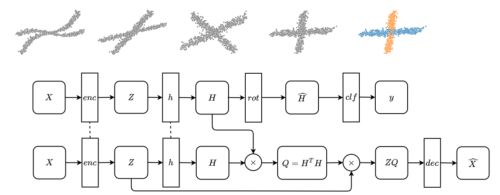

# SSCN


PyTorch-implementation of the *Siamese Subspace Clustering (SSCN)* model proposed in the paper:

[Learning Self-Expression Metrics for Scalable and Inductive Subspace Clustering](https://arxiv.org/pdf/2009.12875.pdf)  
Julian Busch, Evgeniy Faerman, Matthias Schubert, and Thomas Seidl  
NeurIPS 2020 Workshop: Self-Supervised Learning - Theory and Practice

## Setup
Install the required packages specified in the file `requirements.txt`, e.g., using `pip install -r requirements.txt`. Additionally, the packages `torch==1.6.0` and `torchvision==0.7.0` are required and can be installed depending on your system and CUDA version following this guide: [https://pytorch.org/get-started/locally/](https://pytorch.org/get-started/locally/).

## Demo
We provide a demonstration of the inner workings of our model on a small toy dataset. Please check out the notebook `src/demo.ipynb`.

## Running Experiments
- To run experiments or to reproduce the results reported in the paper, you can use the script `src/run_experiment.py`.
- Parameters need to be specified in a config-file in *JSON*-syntax. We uploaded the config-files used in our experiments into the folder `config`.
- Results will be tracked by *MLflow*. We uploaded the results from our runs which can be explored using the notebook `src/evaluate_results.ipynb`.
- Auto-encoders can be trained within the pipeline or pre-trained using the script `src/pretrain_autoencoder.py`. We uploaded the auto-encoder used in our runs into the folder `trained_models`.

## Cite
If you use our model or any of the provided code or material, please cite our paper:

```
@article{busch2020learning,
  title={Learning Self-Expression Metrics for Scalable and Inductive Subspace Clustering},
  author={Busch, Julian and Faerman, Evgeniy and Schubert, Matthias and Seidl, Thomas},
  journal={NeurIPS 2020 Workshop: Self-Supervised Learning - Theory and Practice},
  year={2020}
}
```
